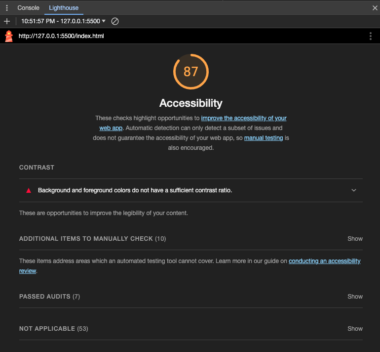

# LAB 201-class-02

## About Me

This is the about me project Day 1. 

### Author: Lana Zumbrunn

### Links and Resources

* John's replit https://replit.com/@lana41/Johns-demo-switch#index.js

### Lighthouse Accessibility Report Score

### Reflections and Comments

* continue to work on understanding of js. 
* work on image upload in .md files! can't get image to work propperly for some reason. 
* what is the file listed as LICENCE on the file set up? Think I missed this and can't find it in class demo repo. 

