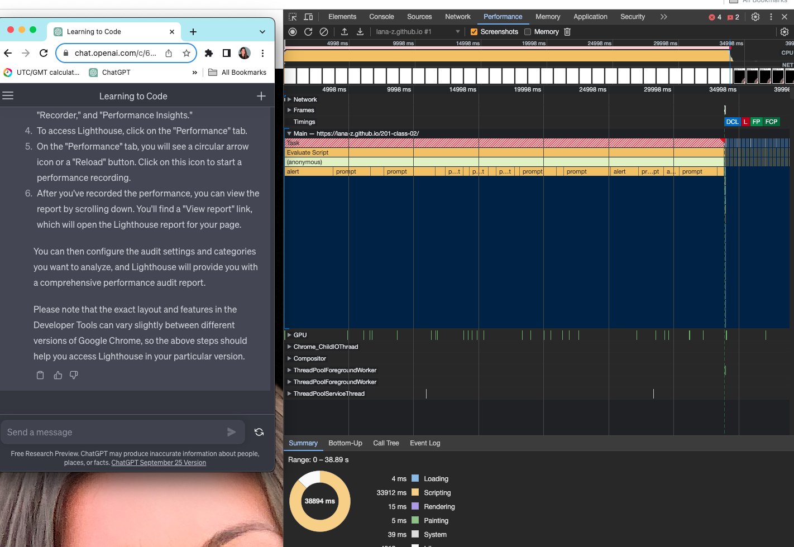

# LAB 201-class-02

## About Me

This is the about me project Day 1. 

### Author: Lana Zumbrunn

### Links and Resources

* John's replit https://replit.com/@lana41/Johns-demo-switch#index.js
* chatGPT

### Lighthouse Accessibility Report Score

### Reflections and Comments

* my css file is not found - getting errors in console log and obviously not rendering to page. Got help from a TA today to be sure file structure was right but it wasn't working so I didn't do the repo-rename in hopes to not further complicate before I talk to Brandon. Will volunteer for code review in class or get help first thing after. 
* Considering just making a new repo and starting from scratch! but submitting this one for tonight. If I do I'll try this from stretch on lab assignment - seems to make more sense:  and responses to the first five yes/no questions into arrays (or even one huge multidimensional array), and modifying the game logic such that a ‘for’ loop will control the flow from question to question.
* Also concerned this isn't working since tomorrow's lab is continuation and with pairs!

These are from yesterday,
* continue to work on understanding of js. 
* what is the file listed as LICENCE on the file set up? Think I missed this and can't find it in class demo repo. 
* look at switch way to do conditions that John demoed today. 
